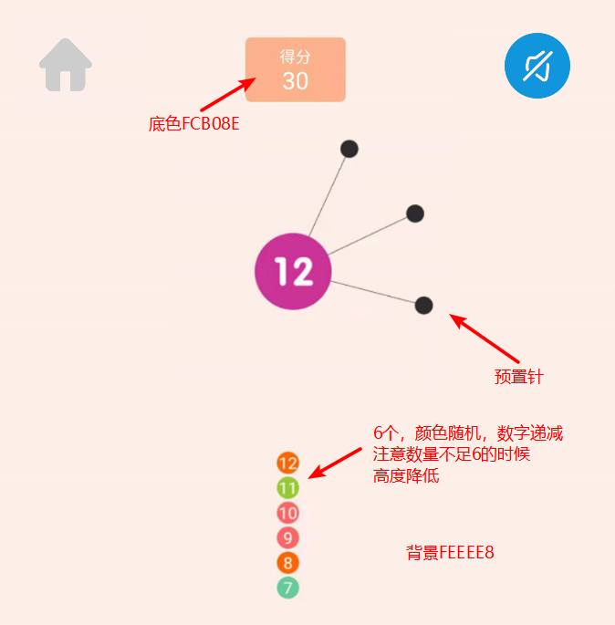

# 汇编语言与接口技术 “见缝插针”游戏文档  
## 1、 概述
尽管MVC在面向对象编程中更为常见，但用于面向过程编程依然有一定的指导意义。  

所有函数使用cdecl方式定义。   

模型并不负责所有逻辑：界面效果的逻辑由界面负责，游戏的逻辑由模型负责。  

共享的数据结构由我提供，**请不要自己定义**。编译时引用sharedVar.inc,并添加sharedVar.asm到工程中即可。  

函数名不允许为main。汇总时，入口函数名为main。如果入口函数非预期，在预处理器中添加以下定义：  
`/entry:main`  
在调试时可以将子系统选为console（可以printf），发布时应将子系统切换至windows。
**在game文件夹内有一个已经搭建好的vs2019工程（asm.sln），大家可以直接用。**

## 2、全局资源
**变量currWindow**
```x86asm
currWindow dd 0  
```
说明：指示当前所在窗口号。0代表主界面，1代表游戏界面，2代表失败界面，3代表成功界面。  
权限：视图可读写、模型和控制器只读。  
维护：视图在载入窗口时自动更新。  

**变量currdeg**  
```x86asm
currdeg dd 0
```
概述：当前的度数。  
权限：模型可读写、视图和控制器只读。  
维护：模型设置定时器定时更新。需要保证更新周期不整除界面显示周期。  

**原始针表pindeg**  
```x86asm
pindeg dd 360 DUP(0)
```
概述：存放某局游戏中每根针的角度的数组，最多存360根。  
权限：模型可读写、视图和控制器只读。 
维护：模型在用户点击时自动更新。  

**剩余针头数量pinnum**  
```x86asm
pinnum dd 0
```
概述：存放某局游戏中还剩多少针。   
权限：模型可读写、视图和控制器只读。 
维护：模型在用户点击时自动更新。  

**psin表**  
```x86asm
psin dd 360 DUP(0)
```
概述：为了避免每次都计算ρ·sin(θ)和ρ·cos(θ)的值，降低计算量，减少函数调用，在启动时一次性计算好对应的数值，后续直接查表即可。(至于为什么需要计算，参考视图部分概述。)    
权限：模型可读写、视图和控制器只读。  
维护：模型在启动时一次性完成计算。  

**pcos表**  
```x86asm
pcos dd 360 DUP(0)
```
概述：同pcos表。  
权限：同上  
维护：同上  

## 3、 模型
主要任务：完成程序的核心逻辑，包括控制逻辑和游戏逻辑。  
文件名：model.asm/model.inc

### 函数  
**主调函数：参考其它部分的被调函数及规定。**


**被调函数（自行实现，供其它部分调用）：**  
控制器回调函数：  
在控制器接收到鼠标/键盘事件时会调用此函数。
```x86asm
KeyboardEvent proc C type:dword   
```


|Type取值|窗口号|含义|
|------|----|----|
|0|0|开始游戏(载入界面1)|
|1|0|退出游戏|
|2|0|静音|
|0|1|发射针（空白区域被点击）|
|1|1|返回主菜单|
|2|1|静音|
|0|2|重复上一局（参数一致）|
|1|2|返回主菜单|	
|0|3|再来一局（参数随机）|
|1|3|返回主菜单|	
		

**私有函数：（建议实现，但不要求）**   
`InsertPin proc C deg:dword  `  
说明：发射针头，并播放音效。  
实现：在里面加入插入表的逻辑。  

`CheckPin proc C deg:dword  `  
说明：检查角度是否符合要求。如果不符合，则终止游戏，否则插入新的针。  
实现：遍历针表  
## 5、 视图
文件名：view.asm/view.inc  
### 1、界面概览
游戏分为四个界面：主界面、游戏界面、失败界面、过关界面（编号0，1，2，3，和变量currWindow的值对应）。以下是界面展示：




各类按钮图标均已在icon文件夹下给出（包括按钮文字）。

实现建议：按钮使用绘图函数、针和圆使用画笔。
### 2、私有数据结构
上图是对界面渲染的简单描述，为了完成渲染，需要以下数据结构。  

**刷新方法：**  
使用定时器以30ms的周期进行刷新圆的旋转。注意：每次刷新都需要根据原始针表完成计算，并重新绘制整个变动区域。因此，模型部分在插入针的时候，相应新增应该在下一次定时器事件到来时自动完成。  


**针的重绘：**  
起点坐标：圆心坐标。  
终点坐标：(currdeg + deg[i]) % 360为当前度数。以这个数为下标查pcos表和psin表。 
### 函数

**被调函数**  
界面的显示完全由模型控制。界面应该实现以下接口供模型调用：  
#### 1、 得分显示。
`FlushScore proc C num: dword`  
说明：刷新记分牌。num：分数。  

**载入游戏界面。**  
所有函数第一步：先修改currWindow的值为0/1/2/3。  
`loadMenu proc C win:dword`  
说明：载入主菜单/失败/成功界面。
参数：win=1/2/3。
注意：执行载入时应当假设目前在GameWindow里，因此要关闭刷新定时器。

`initGameWindow proc C omega:dword,r:dword,rou:dword,ptrTb:dword,ptrDg:dword  `  
说明：初始化游戏界面。调用该函数后，载入游戏窗口。中心应当出现一个带有1~3根预置针（使用变换针表？）、并且在旋转（使用定时器刷新）的圆。  
omega：角速度。单位°/s。  
r：中心圆半径。  
rou：弦长度。  
ptrTb：指向原始针表的指针。  
ptrDg：当前度数指针。  

3、 发射针头。  
`shootPin proc C`  
说明：播放针头发射的动画。（就下面那一堆小彩球往上动一下）  
注：小于6个的时候动画会不一样，建议直接用循环渲染，总计6次。初始化拷贝pinnum，然后循环每次拷贝值减一，如果小于0就不渲染了。


## 4、 控制器
文件名：controller.asm/controller.inc  
作用：处理鼠标和键盘输入，并传送给后端。  
有一说一，咋感觉控制器的任务比其它两块少很多  
得想办法给这个人安排点活.jpg
### 1、概述
建议实现方法：利用ACLLIB库的MouseEvent，判断点击区域的坐标来推算点击的是什么按钮。（不优雅但快）    
骚操作（？）：和界面PY一下，用qt，自带事件，写好后封装成lib给汇编调用。  
如果使用ACLLIB库：为了简化编程，建议引入窗口的概念。使用全局变量标识当前窗口。在MouseEvent里用switch判断当前所在窗口，然后执行对应窗口的区域判断逻辑。  

### 2、函数
实现对模型部分KeyboardEvent函数的回调。
